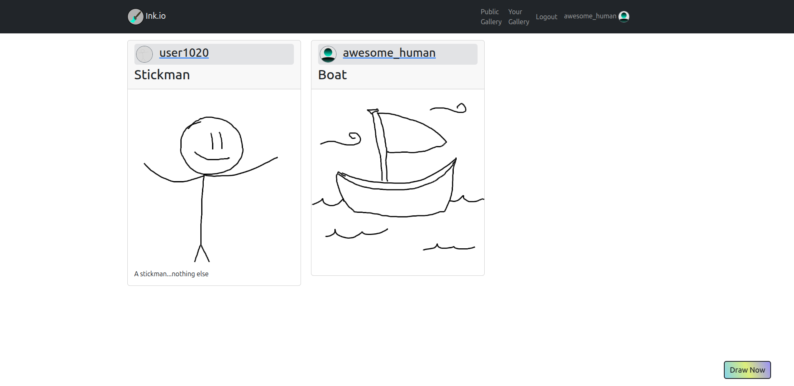
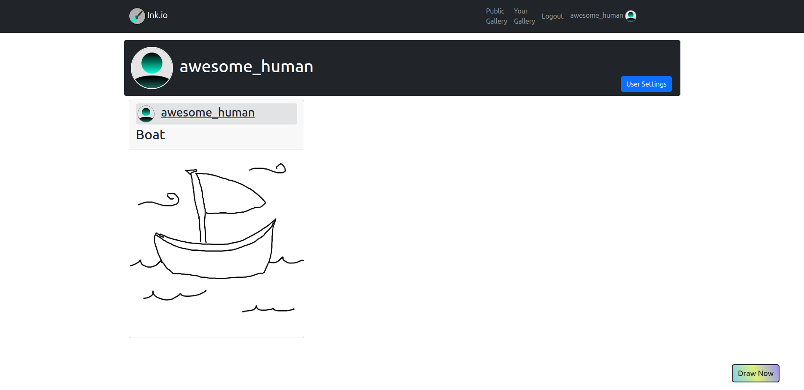
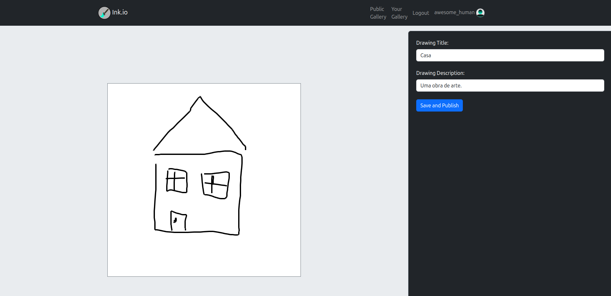
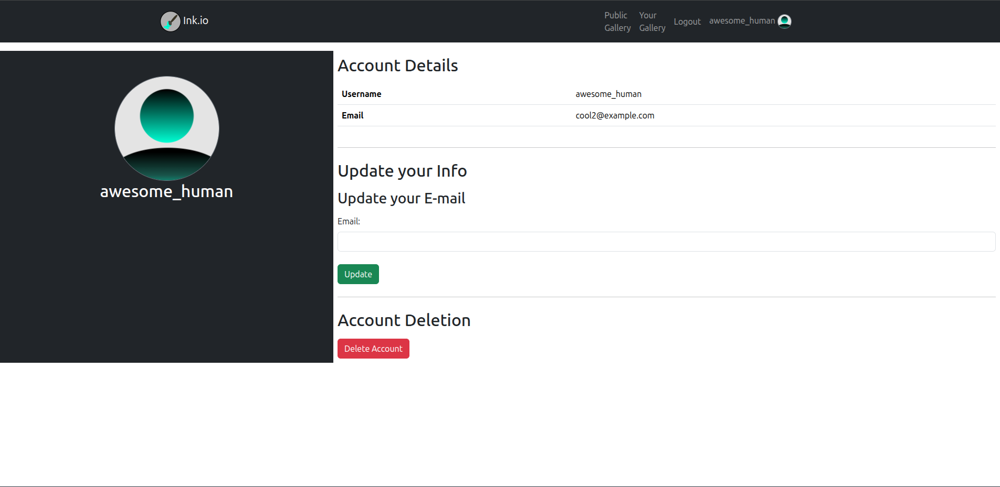

# Ink.io



## 🎯 Objetivo

Como atividade avaliativa da disciplina de Desenvolvimento Web de 2025.1, os alunos devem montar um sistema web que faça uso das tecnologias **HTML, CSS, Bootstrap, MySQL, PHP e JavaScript**. 

Ele deve, também, possuir páginas distintas e realizar operações de CRUD, com tema de livre escolha.
Além disso, é necessário que a aplicação esteja hospedada em uma plataforma on-line, de forma a estar publicamente acessível.

## 🖌️ Ink.io - O que é?
A aplicação desenvolvida é nomeada, de forma fictícia, como Ink.io.

### Próposito
Ser uma plataforma de rede social destinada a quem deseja mostrar habilidades artísticas com desenhos feitos de forma breve e/ou com poucos recursos, desenhando-os e compartilhando-os pela própria aplicação. 

### Um usuário pode

- Criar sua própria conta;
- Desenhar e publicar seus desenhos;
- Visualizar uma galeria pública de desenhos publicados;
- Ver desenhos de contas específicas, visitando páginas de usuários;
- Editar seu e-mail de cadastro;
- Apagar sua conta, caso deseje.

## 🖥️ Tecnologias Usadas

- HTML
- CSS
- JS
- Bootstrap
- PHP
- Apache
- Docker
- Composer

## 📄 Principais Páginas

### Galeria de Usuário

Galeria que expõe os desenhos de um usuário específico.  
Caso seja o usuário logado, haverá um botão para que ele acesse sua página de configurações.


### Galeria Pública

Galeria que expõe os desenhos postados, de diversos usuários.



### Página de Desenho

Permite que o usuário faça um desenho e publique-o.



### Página de Configurações

Permite que o usuário atualize seu e-masenhail ou apague sua conta.



## ⚙️ Como inicializar?

1. Faça git pull ou clone da aplicação para a pasta local.
```
    git clone https://github.com/guirque/Ink.io.git .
```

2. Crie e preencha o .env
```
    cp .env.example .env
```

2. Tendo instalado Docker e Docker Compose, no repositório da aplicação:
```
    docker compose up
```
A aplicação começará a rodar e será possível visitar a página padrão do servidor Apache em ``localhost``, pelo navegador.

3. Observe os contêineres rodando:
```
    docker ps
```

Encontre o Id do contêiner MySQL associado à aplicação. 

4. Acesse o contêiner do Banco de Dados com o Id encontrado.
```
    docker exec -it <id_bd> /bin/bash
```

5. Acesse o BD

```
    mysql -u root -p
```

Será solicitada a senha associada. Ela é a mesma preenchida no .env, em ``MYSQL_ROOT_PASSWORD``.

6. Acesse-o e crie as tabelas necessárias.
```
    use <nome_bd>;
```
O "nome_bd" foi preenchido no .env, em ``MYSQL_DATABASE``.  
O código de criação das tabelas está disponível em ``db_utils/init.sql``.

7. Por último, para que se possa acessar o host virtual criado com nome de Ink.io, é necessário que o nome seja reconhecido ao menos localmente. Em sistemas Linux, no arquivo `/etc/hosts`, adicione a linha
```
127.0.1.1 ink.io
```
Isso vai permitir que o nome seja resolvido (reconhecido) localmente. 

Agora, será possível visitar o site em `http://ink.io` pelo navegador.

> Obs.: O caminho ``src/public/photos`` deve conter duas pastas, com os nomes dados no arquivo .env, em `USER_DRAWING_PATH` e `USER_PROFILE_PATH`. Eles são usados para armazenamento de imagens.

## 🛠️ Detalhes de Funcionamento

A aplicação roda sobre Docker, com um contêiner em uma imagem Ubuntu, dedicado ao servidor Apache, e outro, com uma imagem MySQL. 

Sobre os dados armazenados, senhas são codificadas por `password_hash`, com PHP, e sessões são gerenciadas criando-se cookies, com tokens JWT assinados com uma senha secreta do servidor. 

Para a criação de tokens JWT e sua decodificação, foi usado o pacote externo [php-jwt, de Firebase, disponível no GitHub](https://github.com/firebase/php-jwt), e incorporado no projeto com uso do gerenciador de pacotes Composer.

## 📁 Distribuição de Pastas

As funcionalidades do sistema estão distribuídas em pastas, de acordo com as responsabilidades de cada arquivo. Exemplos:

```
.
└── src/
    ├── components/
    ├── middleware/
    ├── private_pages
    ├── public/
    │   ├── api
    │   ├── img
    │   ├── css
    │   ├── js
    │   └── photos
    └── utils
```
> Obs.: Árvore gerada em [tree.nathanfriend.com](https://tree.nathanfriend.com/).

### Detalhamento

<table>
<tr>
    <td><code>src/</code></td>
    <td>
    pasta principal. Contém arquivos não relacionados a configurações, específicos de infraestrutura ou dependências externas.
    </td>
</tr>
<tr>
    <td><code>src/components/</code></td>
    <td>
    arquivos php com conteúdo HTML reutilizável.
    </td>
</tr>
<tr>
    <td><code>src/middleware/</code></td>
    <td>
    arquivos de php que podem ser usados para interceder requisições. Seu único arquivo é o authorized.php, que é usado para verificar se usuário está autenticado e permitir ou não o acesso a uma página.
    </td>
</tr>
<tr>
    <td><code>src/private_pages/</code></td>
    <td>
    páginas acessadas somente por carregamento de outras páginas. Páginas que requerem autenticação prévia se encontram aqui.
    </td>
</tr>
<tr>
    <td><code>src/public/</code></td>
    <td>
    arquivos servidos publicamente pelo servidor.
    </td>
</tr>
<tr>
    <td><code>src/public/api/</code></td>
    <td>
    endpoints não focadas no carregamento de páginas.
    </td>
</tr>
<tr>
    <td><code>src/public/css/</code></td>
    <td>
    arquivos css.
    </td>
</tr>
<tr>
    <td><code>src/public/img/</code></td>
    <td>
    arquivos de imagens relativas ao sistema.
    </td>
</tr>
<tr>
    <td><code>src/public/js/</code></td>
    <td>
    arquivos js.
    </td>
</tr>
<tr>
    <td><code>src/public/photos/</code></td>
    <td>
    imagens guardadas relativas a usuários. São identificadas em registros no BD e, se não default, possuem identificadores únicos gerados pelo servidor.
    </td>
</tr>
<tr>
    <td><code>src/utils/</code></td>
    <td>
    funções que podem ser de uso para mais de um arquivo, como validação de cookies e emissão de alertas em páginas de usuário.
    </td>
</tr>
</table>

## 💻 Hospedagem

A plataforma de hospedagem escolhida foi a AWS: utilizou-se uma instância EC2 para rodar a aplicação com Docker e a expor num IP publicamente visível. Por ter sido disponibilizada apenas para a apresentação do projeto, não há link a ser compartilhado.